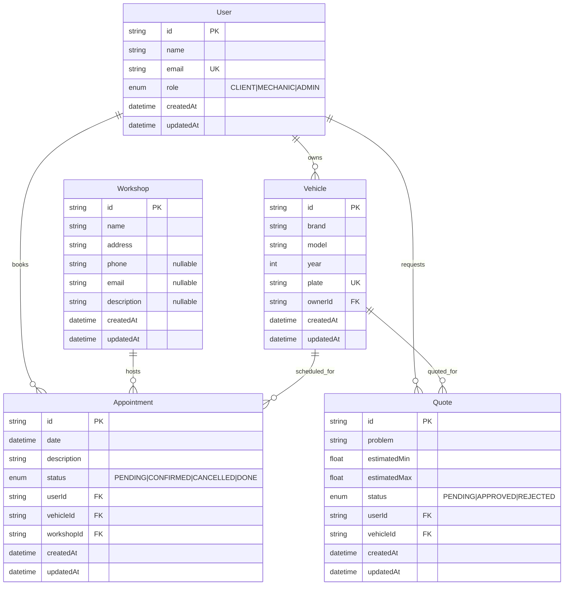

# 🚗 MechanIQ

MechanIQ is a web application designed for car workshops and vehicle owners to simplify the process of **diagnosis, quoting, and appointment scheduling**.

It allows users to:
- Self-diagnose common vehicle issues
- Get an estimated repair cost
- Book an appointment for a detailed inspection
- Keep a history of diagnostics by vehicle

It allows workshops to:
- Manage incoming requests
- Confirm or correct estimations
- Organize their agenda
- Track customers and vehicles

This project is also part of my professional portfolio, focused on **Next.js + TypeScript** to expand my stack beyond Ruby on Rails & React.

---

## 🎯 Purpose

- Gain hands-on experience with **Next.js (App Router)**
- Implement a real-world, industry-focused solution
- Apply best practices in architecture and clean code
- Build a production-ready app to showcase in interviews
- Expand my skills in the JavaScript / React ecosystem

---

## ✨ Main Features

### For Customers
- Register vehicles (brand, model, year, engine)
- Guided self-diagnosis based on symptoms
- Approximate budget estimation
- Image / video upload for better analysis
- Appointment booking
- Diagnosis & repair history

### For Workshops
- Admin dashboard
- View incoming diagnostics
- Confirm or adjust estimated quotes
- Manage appointments
- Customer & vehicle management

---

## 🛠 Tech Stack

- **Next.js 14 (App Router)**
- **TypeScript**
- **TailwindCSS**
- **shadcn/ui**
- **Prisma**
- **PostgreSQL** (Supabase or Railway)
- **NextAuth / Clerk (Authentication)**
- **React Hook Form + Zod (Forms + Validation)**
- **Cloudinary / AWS S3 (Media upload)**
- **Vercel (Deployment)**

Optional / Future enhancement:
- AI-assisted diagnostics (OpenAI or similar)

## 🚀 Getting Started

### 1. Clone repository

```bash
git clone https://github.com/your-username/mechaniq.git
cd mechaniq
```


# Entity Relationship Diagram

This ERD represents the database schema for the Mechaniq application.



## Relationships

- **User → Vehicle**: One-to-Many (One user can own multiple vehicles)
- **User → Appointment**: One-to-Many (One user can book multiple appointments)
- **User → Quote**: One-to-Many (One user can request multiple quotes)
- **Workshop → Appointment**: One-to-Many (One workshop can host multiple appointments)
- **Vehicle → Appointment**: One-to-Many (One vehicle can have multiple appointments)
- **Vehicle → Quote**: One-to-Many (One vehicle can have multiple quotes)

## Legend

- **PK**: Primary Key
- **FK**: Foreign Key
- **UK**: Unique Key

